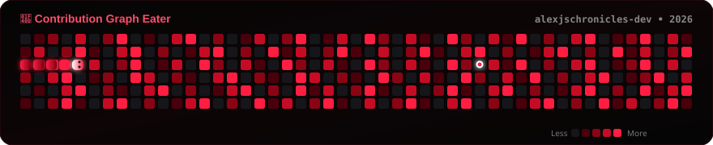

<div align="center">

<!-- SVG Banner in Red, Black, White combo -->


<br/>

<!-- Red & White Typing Header -->


<br/><br/>

<p>
  <a href="mailto:alexjschronicles@gmail.com">
    
  </a>&nbsp;
  <a href="https://discord.gg/CRbua5bHNV">
    
  </a>&nbsp;
  <a href="https://loveofart.online">
    
  </a>&nbsp;
  <a href="https://github.com/alexjschronicles-dev">
    
  </a>
</p>


</div>

---

<div align="center">

## 🔴 About Me

</div>

```javascript
╔══════════════════════════════════════════════════════════════╗
║                    ALEX JS  •  Chronicles                    ║
╚══════════════════════════════════════════════════════════════╝

const alex = {
    name         : "ALEX JS",
    title        : ["Discord Bot Developer", "Frontend Web Developer"],
    community    : "Chronicles",
    location     : "India",

    languages    : ["JavaScript", "TypeScript"],

    currentStack : {
        frontend  : ["React", "Next.js", "HTML5", "CSS3", "Tailwind"],
        backend   : ["Node.js", "Express.js"],
        bots      : ["Discord.js", "Slash Commands", "Lavalink"],
        databases : ["MongoDB", "MySQL"],
        tools     : ["Git", "GitHub", "VS Code", "npm"],
    },

    currentlyBuilding : [
        "Premium Discord Bots with AI integration",
        "Full-Stack Web Applications",
        "Music Streaming Platform with Lavalink",
        "Enterprise Ticket & Moderation Systems",
    ],

    motto : "KEEP CODING • KEEP GROWING",
};
```

---

## 🚀 Tech Stack

<div align="center">

### 🌐 Frontend


### ⚙️ Backend & Databases


### 🛠️ Tools & Platforms


</div>

---

## 📊 GitHub Statistics

<div align="center">


</div>

---

## 🏆 Achievements

<div align="center">


</div>

---

## 📁 Featured Projects

<div align="center">

| | Project | Description | Tech | Status |
|:---:|---------|-------------|:----:|:------:|
| 🤖 | **ART OF LOVE** | Premium Discord Bot — Moderation, Utility, Fun | `Discord.js` | 🔴 Live |
| 👑 | **Chronicles Community** | Community Hub & Management Platform | `Node.js` `MongoDB` | ⚪ Active |
| 🌐 | **Portfolio Website** | Modern Animated Developer Portfolio | `HTML` `CSS` `JS` | 🔴 Live |
| 🎵 | **Music Platform** | Lavalink-powered Music Streaming | `React` `Lavalink` | 🔨 Building |
| 🎫 | **Premium Ticket System** | Enterprise-grade Ticket Bot | `Discord.js` `MongoDB` | 🔴 Live |
| 🛡️ | **Moderation Bot** | Auto-Mod, Anti-Raid & Security Suite | `Discord.js` | 🔴 Live |

</div>

---

## 📈 Contribution Activity

<div align="center">


</div>

---

## 🐍 Contribution Snake

<div align="center">



</div>

---

## 🌟 Current Focus

<div align="center">

| Priority | Goal |
|:--------:|------|
| 🔴 **HIGH** | AI-powered Premium Discord Bots |
| ⚪ **HIGH** | Full-Stack Next.js Applications |
| 🔴 **MED**  | Advanced Auto-Moderation Systems |
| ⚪ **MED**  | Open Source Bot Templates |
| 🔴 **LOW**  | Growing Chronicles Community |

</div>

---

## 📬 Connect With Me

<div align="center">

<a href="mailto:alexjschronicles@gmail.com">
  
</a>&nbsp;
<a href="https://discord.gg/CRbua5bHNV">
  
</a>&nbsp;
<a href="https://loveofart.online">
  
</a>&nbsp;
<a href="https://github.com/alexjschronicles-dev">
  
</a>

<br/><br/>

> 🔴 **Open for:** Bot Commissions • Collaborations • Open Source Projects

<br/>


<br/><br/>

**Made with ❤️ by ALEX JS — Chronicles Community**


</div>
